---
title:
output: 
  revealjs::revealjs_presentation:
    theme: white
    highlight: tango
    center: true
    transition: none
    reveal_options:
      progress: true
      slideNumber: true
    css: custom.css
references:
- type: book
  id: wickham2017
  author:
  - family: Wickham
    given: Hadley
  - family: Grolemund
    given: Garrett
  issued: 2017
  title: R for Data Science
  publisher: O’Reilly
  URL: http://r4ds.had.co.nz/
- type: book
  id: healy2017
  author:
  - family: Healy
    given: Kieran
  issued: 2017
  title: Data Visualization for Social Science
  URL: http://socviz.co/
---

```{r setup, include=FALSE}
  library(knitr)
  knitr::opts_chunk$set(echo = TRUE, message = FALSE)
  #opts_knit$set(root.dir=normalizePath('../'))
  library(tidyverse)
```

## {data-background="monrovia2018_cover.jpg"}

<style type="text/css">
p { text-align: left; }
</style>

## Objectives

By the end of this session, you should be able to:

* State the benefits of a reproducible analysis
* Explain the layout of the RStudio interface
* Write Rmarkdown syntax and knit an Rmarkdown file
* Read a R help file
* Import data from CSV, RDS, Stata, SAS, SPSS, URLs, and APIs
* Inspect R objects
* Conduct initial data checks
* Reproduce this plot...

## Today's Goal

<center>
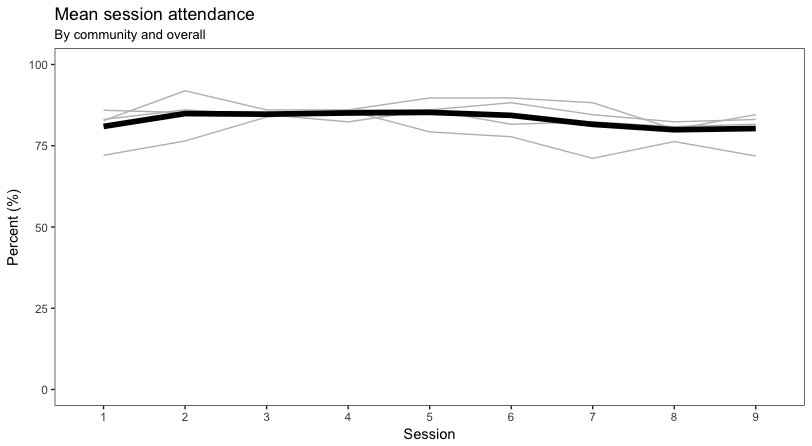
</center>

## Install R and RStudio

* Copy the `workshop` folder from the USB drive to your desktop
* Open the `installers` folder and find the correct folder for your operating system
* Install R
* Install RStudio

## Reproducibility

I will show you how to make your analyses reproducible. We will write code to import raw data, do some data manipulation, analyze the data and create a plot, and generate a report. This is the beginning of the end of editing raw data files and pointing and clicking your way to an analysis that is hard to reproduce.

## Literate Programming

I'll also show you how to combine your analysis code with your write-up. This means the end is near for copying/pasting results, tables, and figures from your stats program/Excel to your report. 

## Data Analysis Pipeline

<center>
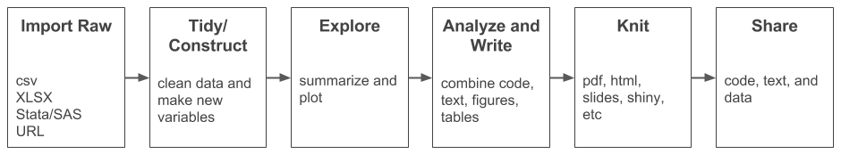
</center>

## Tools

* **RStudio**: provides a nicer interface for using R and an authoring framework for data science
* **LaTeX**: helps behind the scenes to knit to PDF and offers more control over typesetting
* **Zotero, BibDesk, and .bib files**: manage references 

## {data-background-iframe="http://rmarkdown.rstudio.com/"}

## {data-background-iframe="https://player.vimeo.com/video/178485416?color=428bca&title=0&byline=0&portrait=0"}

## RStudio Interface

<center>
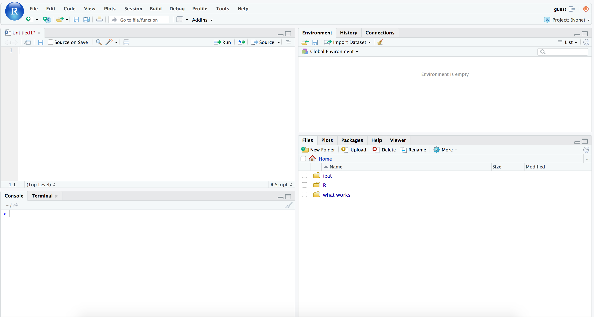
</center>

## RStudio Interface

<center>
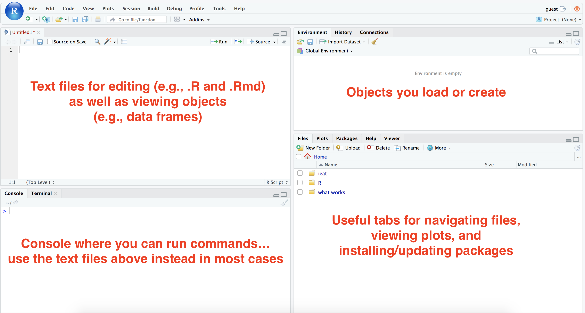
</center>

## Optional: Change your layout

`Tools > Global Options`

<center>
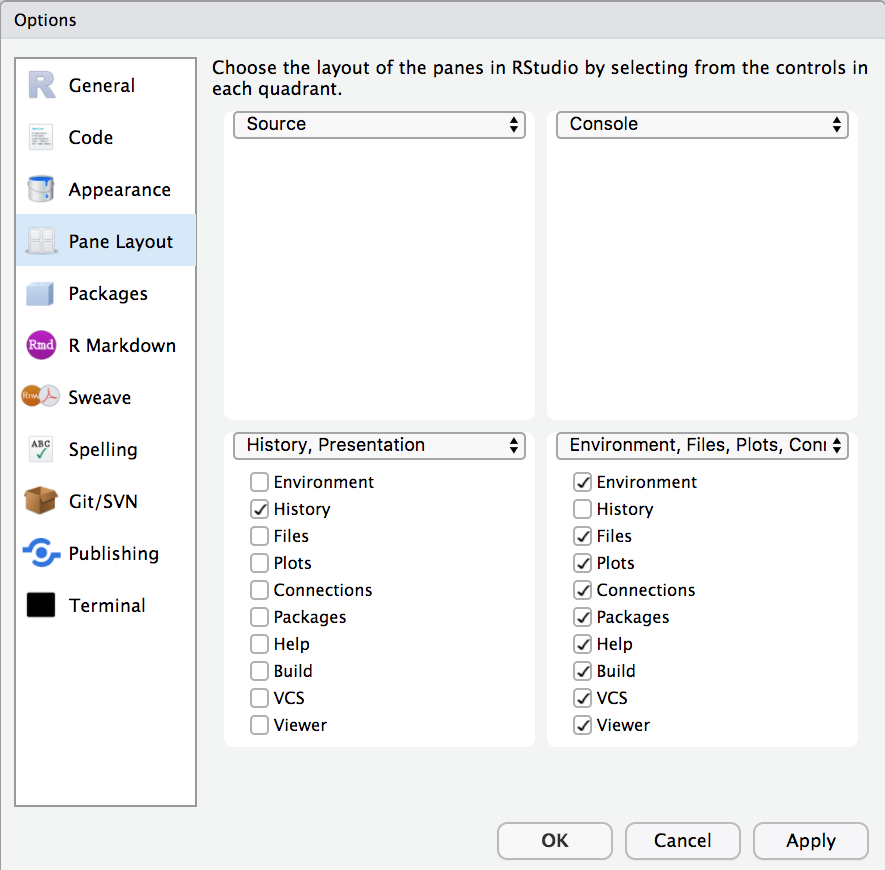
</center>

## Projects

You can create a new RStudio project for every real life project you have. Just tell RStudio to find the project folder on your computer. A major benefit of projects is that all of the file paths will be relative to the root directory of your project.

I created a project for you today. Find the `workshop` folder on your desktop and double click on the RStudio project file. This will open our project in RStudio.

## Working directory

In your console run:

```{r, eval=FALSE}
getwd()
```

Since you opened our project file, R should think that your working directory is your project directory.

## Relative file paths

Every file reference should be relative to this working (root) directory. 

* `../` goes up one level
* `../../` goes up two levels
* `subdirectory/` does down one level
* `subdirectory/subsubdirectory/` goes down two levels

## Typical Organization

<center>
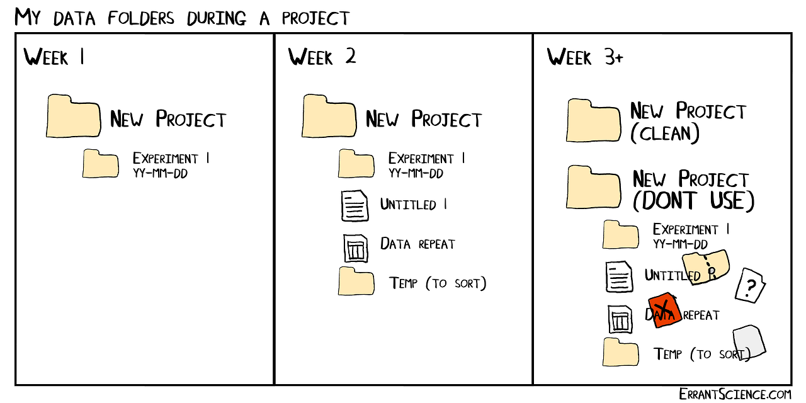
</center>

## Better Organization

<center>
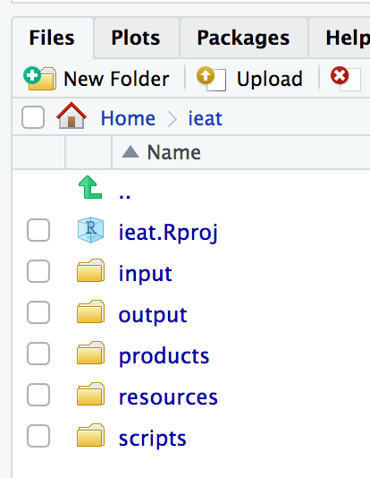
</center>

## New files

<center>
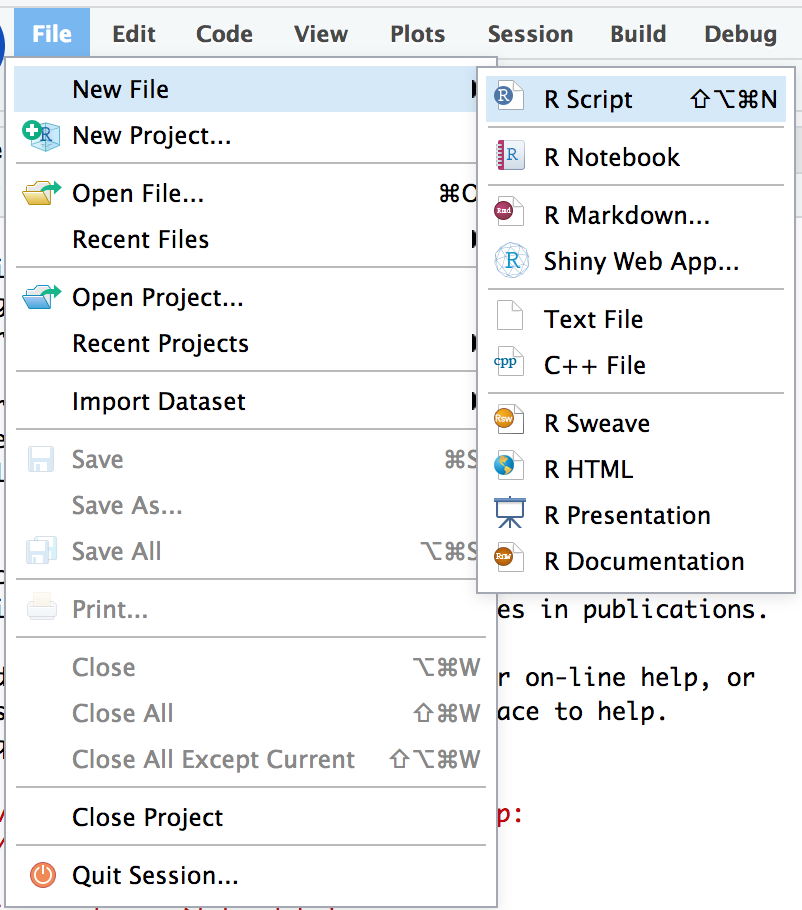
</center>

## R script

Create a new R script file

* similar to Stata's do file
* not interactive
* output appears in console and plot window

<center>
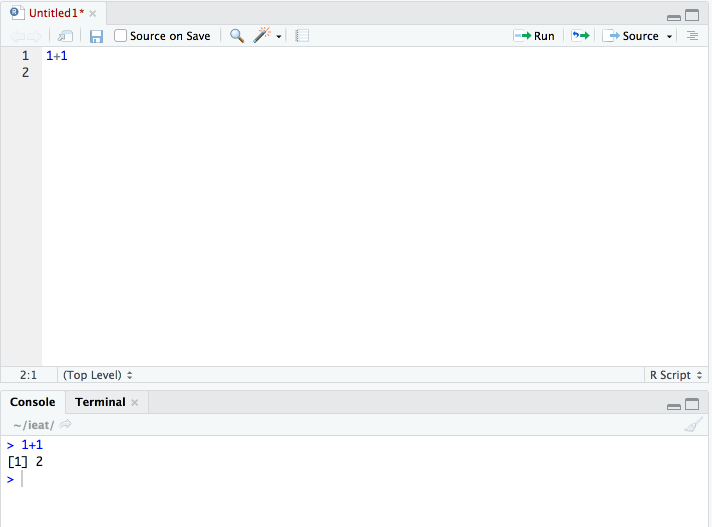
</center>

## RMarkdown

Create a new RMarkdown HTML file

<center>
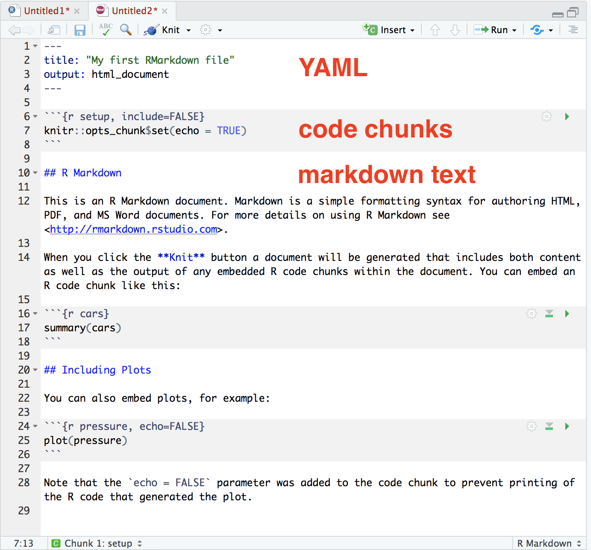
</center>

## Open the Attendance Report

I created a report `Rmd` file for you. Look for the FILES tab and open the `reports` folder.

## A tricky thing

When you knit a document, RStudio thinks that the directory where the document is saved should be the working directory. If your template is stored in `workshop/reports`, for instance, `reports` will become the working directory and relative file paths won't work. To fix this, we added the following to the R code chunk named `setup`: 

```{r, eval=FALSE}
  opts_knit$set(root.dir=normalizePath('../'))
```

This tells RStudio that the working directory is 1-level up from where the report file sits.

## Markdown language

```{r, eval=FALSE}
Plain text, *italics*, **bold**, `monospaced font`

~~strikethrough~~, sub/superscript^2^~2~, endash: --, emdash: ---
  
equation: $A = \pi*r^{2}$
  
$$E = mc^{2}$$
  
> block quote 
  
list:
  
  * item 1
  * item 2
  * item 3
```

## Markdown Language

Plain text, *italics*, **bold**, `monospaced font`

~~strikethrough~~, sub/superscript^2^~2~, endash: --, emdash: ---
  
equation: $A = \pi*r^{2}$
  
$$E = mc^{2}$$
  
> block quote 
  
list:
  
  * item 1
  * item 2
  * item 3
  
## Write some Markdown text

Turn to the back of your Markdown cheatsheet and try writing some text under the "Markdown Practice" heading (e.g., bold, italics, lists, subheadings, web links, footnote). Then click "Knit" to compile the document. 

## Getting help

* Google
* Read the documentation
* Stack Overflow
* Github issues / listserves for specific packages
* New: [https://community.rstudio.com/](https://community.rstudio.com/)

## An unexpected result!

```{r}
x <- c(4, 2, 6, 9, 2, 5, 4, 3, 7, 6, 8, 4, 7, 2, NA, 3)
x_mean <- mean(x)
x_mean
```

## ?function

`?mean`

<center>
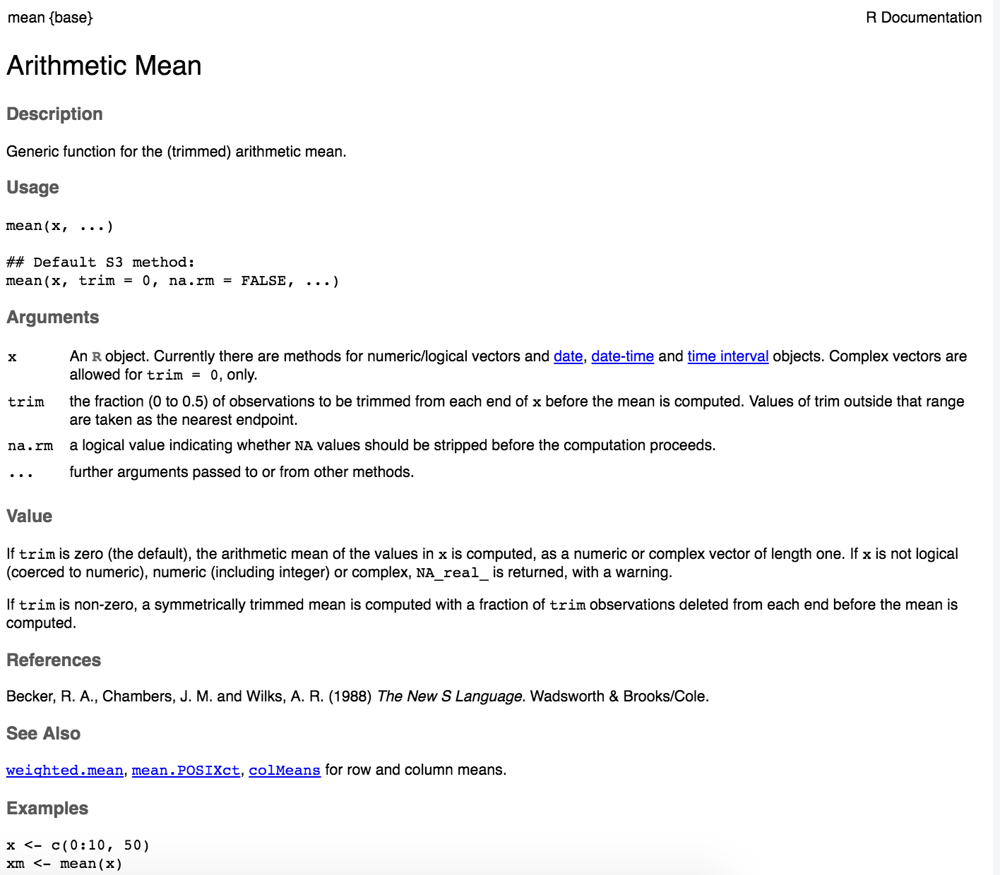
</center>

## Stack Overflow

<center>
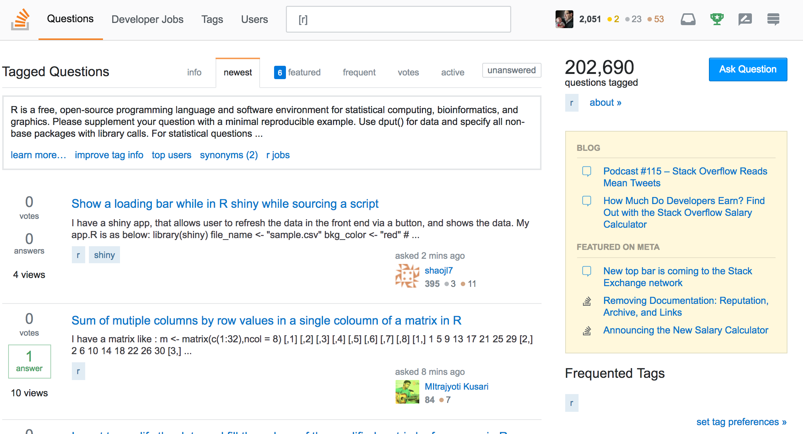
</center>

## Bad questions

<center>
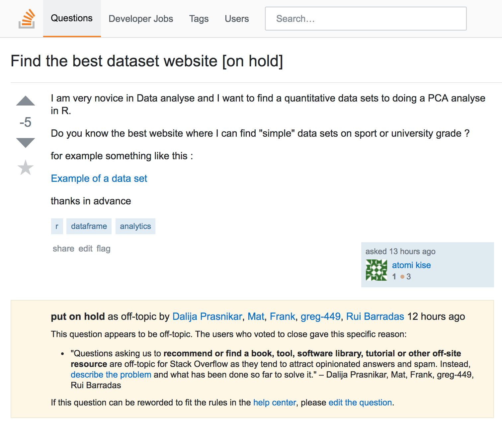
</center>

## Reproducible Example

<center>
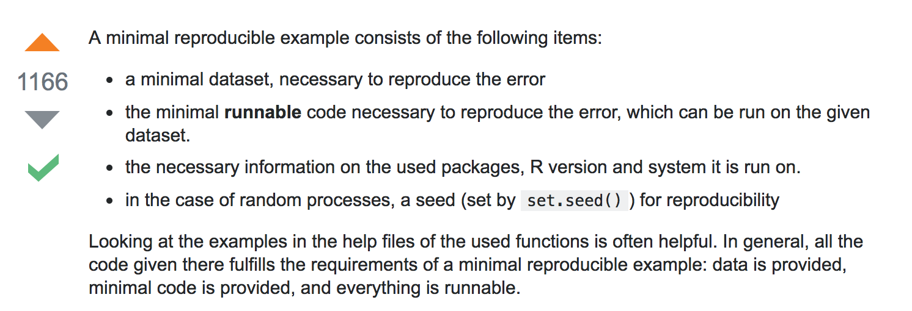
</center>

## <span style="color:red">Low frustration tolerance?</span> {data-background-image="https://media.giphy.com/media/kHU8W94VS329y/giphy.gif"}

## Remember this

> R does exactlly what you tell it to do, rather than what you want it to do
<br>
-Kieren Healy

* No one writes error-free code the first time
* De-bugging and testing are part of the process
* Each error you make teaches you something about how R works

## Common mistakes

* Unbalanced (parentheses
* Completing expressions (+ vs. > in the command line)
* Code that wraps across lines (+)
* Spelling!

## Let's import some data

* csv
* Excel
* Google Sheets
* Stata
* APIs

## CSV

A csv file is an ideal format for sharing data. Simple. Lightweight. Readable by any program. Import with the `read.csv()` function. Start by running `?read.csv` in the console to view the help file.

<center>
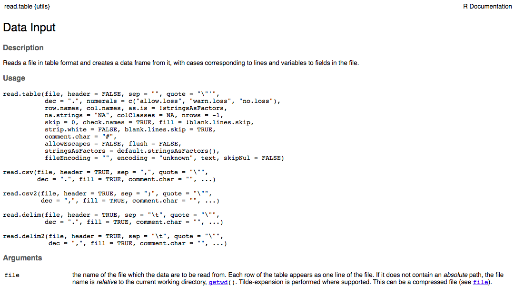
</center>

## ? Help File

`?read.csv`: What arguments are required?

<center>
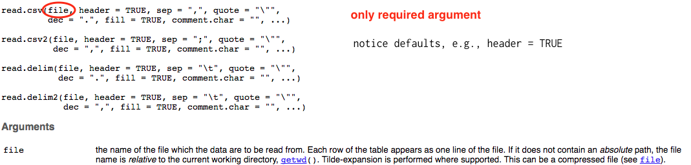
</center>

## Today's Example

<center>

</center>

## Today's Example

The data underlying this plot are stored in 4 `csv` files, one for each community. 

## Import the Data

Let's import the first csv file. Type the following in the `import` code chunk.

```{r}
  c2AG <- read.csv("input/c2AG.csv", 
                   stringsAsFactors = FALSE,
                   na.strings=c("","NA"))
```

This will create an object called `c2AG`. You can call it whatver you want, but for today use `C2AG` for "Community 2 Attendance Group". Find this object in your ENVIRONMENT and take a look.

## Import the Data

Now import the three other `csv` files and name them `c3AG`, `c4AG`, and `c5AG`.

## Import the Data

```{r}
  c3AG <- read.csv("input/c3AG.csv", 
                   stringsAsFactors = FALSE,
                   na.strings=c("","NA"))
  c4AG <- read.csv("input/c4AG.csv", 
                   stringsAsFactors = FALSE,
                   na.strings=c("","NA"))
  c5AG <- read.csv("input/c5AG.csv", 
                   stringsAsFactors = FALSE,
                   na.strings=c("","NA"))
```

## RDS

Any R object can be saved as an RDS file, so you might need to import from RDS on occassion:

```{r loadRDS, eval=FALSE}
  RDS <- readRDS("input/c2AG.rds")
```

## Import from other stats programs

Maybe a collaborator works in Stata, SAS, or SPSS and wants to make the jump to R. No problem, just load the `haven` package:

```{r loadSTAT, eval=FALSE}
  install.packages("haven") # need to run this line once
  library(haven)
```

## Import from other stats programs

```{r loadSTAT2, eval=FALSE}
  STATA <- read_dta("input/c2AG.dta")
  SAS <- read_sas("input/c2AG.sas7bdat")
  SPSS <- read_sav("input/c2AG.sav")
```

To export to these programs, just use the `write_` functions in `haven`.

## Import from Excel

Or maybe you have descended into the 6th circle of hell (heresy) and you are given data stored in Excel files. You can manually convert to CSV files and import, or you can use the `readxl` package that is part of the `tidyverse`.

```{r loadXLSX, eval=FALSE}
  library(readxl)
  excel_sheets("input/c2AG.xlsx")  # list sheets
  XLSX <- read_excel("input/c2AG.xlsx", sheet="mySheet")
```

## Import flat files from the Web

You can use the `RCurl` package to grab data from the web. This link goes to a csv published on Google Drive.

```{r loadURL, eval=FALSE}
  # install.packages(RCurl) # run this line once
  library(RCurl)
  url <- getURL('https://docs.google.com/spreadsheets/d/e/2PACX-1vRbBWObJmUpE3GTnse4EVlAnyyY6EdRYWhCOLiEEosVKW3UcQY2f4IiW7mzs5Qr8vNOCuJchSWboh2X/pub?gid=0&single=true&output=csv', 
                ssl.verifyhost=FALSE, ssl.verifypeer=FALSE)
  URL <- read.csv(textConnection(url), header=T)
```

(Check out the [`googlesheets` package](https://cran.r-project.org/web/packages/googlesheets/vignettes/basic-usage.html) if you want to read and write from YOUR Google Sheets account.)

## Import data from APIs

```{r loadJSON, message=FALSE}
  source("https://tinyurl.com/y74jnzsc") # authentication code
  twitter_user <- "realDonaldTrump"
  url <- paste0("https://api.twitter.com/1.1/statuses/user_timeline.json?",
                "count=10&",
                "screen_name=", twitter_user)
  req <- httr::GET(url, httr::add_headers(Authorization = token))
  json <- httr::content(req, as = "text")
  tweets <- fromJSON(json)
  substring(tweets$text, 1, 100)
```

## Connect to Databases

RStudio makes it easy to connect to a wide range of databases, query/analyze the data inside the database, and only import what you need into R. 

<center>

</center>

See [RStudio](https://db.rstudio.com/) for more details.

## Inspect the objects

```{r str, eval=FALSE}
  str(c2AG)
```

<center>
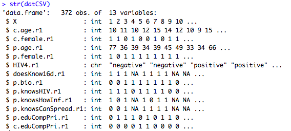
</center>

## Data frame {data-background=#f4c842}

R has several data types. `c2AG` is a **data frame** that consists of 136 rows and 22 variables. Let's use two built-in functions to do this count and print the results in line. Go to where you see the following line:

> The `datCSV` data frame has ... observations (rows) and ... columns.

Replace the first `...` with `` `r
nrow(c2AG)` `` for the number of rows, and replace the second `...` with `` `r
length(c2AG)` `` for the number of columns. Then knit your document.

## Glimpse

We can also examine `c2AG` with the `glimpse()` function in the `dplyr` package, which is included in the `tidyverse`. Create a new R code chunk and type.

```{r glimpse, eval=FALSE}
  library(tidyverse)
  glimpse(c2AG)
```

## Hide output {data-background=#f4c842}

Knit the file and you'll see that the glimpse results print. Replace `{r glimpse}` with `{r glimpse, results='hide'}` and knit again.

## Stop code from printing {data-background=#f4c842}

To turn off code printing, replace `{r glimpse, results='hide'}` with `{r glimpse, results='hide', echo=FALSE}` and knit again.

## Head/Tail

You can also use the functions `head()` or `tail()` to examine the first or last few rows.

```{r head, eval=FALSE}
  head(c2AG)
  tail(c2AG)
```

## Quick exploration

One option for a quick summary of the dataframe is:

```{r summary, eval=FALSE}
  summary(c2AG)
```

But this can be unweildly when your dataframe is big.

## You can also make simple cross-tabs

```{r table, eval=FALSE}
  names(c2AG)
  table(c2AG$group, useNA="always")
```

`names(c2AG)` is a quick way to get the names of all variables (columns) in a dataframe.

## Introduction to $

* `c2AG` tells R to do something with the `c2AG` dataframe
* `c2AG` followed by the `$` lets you access specific columns; RStudio will prompt you with column names as soon as you type `$` after the name of a dataframe

## Introduction to NA

* NA means missing data in R
* A common trap in analysis is not understanding how the function you are using handles NAs by default

```{r missing, eval=FALSE}
  is.na(c2AG$S1G)      # gives a logical T/F if values is missing
  sum(is.na(c2AG$S1G)) # another way to count NA
  any(is.na(c2AG$S1G)) # tests if there are any NAs
```
## 5 key wrangling functions

function      purpose
--------      --------
`filter()`    Pick observations by their values
`arrange()`   Reorder the rows
`select()`    Pick variables by their names
`mutate()`    Create new variables
`summarise()` Create summaries

See @wickham2017 for more details and examples

## Filter

`filter()` lets you subset based on row values. Just give it a data frame and one or more conditions.

```{r, eval=FALSE}
  filter(c2AG, S1A == 1) # attended the first session
  filter(c2AG, S1A == 1 & S2A == 1) # attended the first AND second session
  filter(c2AG, S1A == 1 | S2A == 1) # attended the first OR second session
```

Logical operators and (`&`), or (`|`), not (`!`), equals (`==`). How many observations do we have of caregivers who attended the first and second sessions?

## Arrange

`arrange()` sorts your dataframe according to one or more conditions.

```{r arrange, eval=FALSE}
  arrange(c2AG, hhid)      # ascending
  arrange(c2AG, desc(hhid)) # descending
```

## Select

`select()` lets you grab just a subset of columns from your data frame.

```{r select, eval=FALSE}
  select(c2AG, hhid, S1A, S1G)
  select(c2AG, starts_with("S")) 
  select(c2AG, ends_with("G"))   
  select(c2AG, contains("A"))    
```

## Mutate

`mutate()` creates new columns. In this example, we first create a smaller data frame called `temp` to make it easier to see the new variable `ageDifference` that we create in the second step.

```{r mutate, eval=FALSE}
  temp <- select(c2AG, contains("A"))   
  mutate(temp, 
         attended = rowSums(temp, na.rm=TRUE),
         attendedAll = ifelse(attended==10, "yes", "no"))
```

## Row Bind

Before we learn how to `summarise()`, let's combine our dataframes from each community into one large dataframe. Each table has the same columns, so we want to append or add the rows. We'll use the `bind_rows()` function. But first, let's add a variable to each table that indicates the community number.

```{r community}
  c2AG <- mutate(c2AG, community = 2)
  c3AG <- mutate(c3AG, community = 3)
  c4AG <- mutate(c4AG, community = 4)
  c5AG <- mutate(c5AG, community = 5)
```

## Row Bind

Now we can bind the tables together.

```{r bind}
  all <- bind_rows(c2AG, c3AG)
  all <- bind_rows(all, c4AG)
  all <- bind_rows(all, c5AG)
```

What is the dimension of the `all` table (data frame)?

## Summarise

`summarise()` collapses the data to summary values. It can be used with the `group_by` function to summari(z)e by group.

```{r summarise, eval=FALSE}
  summarise(all, meanS1 = mean(S1A)) # mean (proportion) attending session 1
  by_community <- group_by(all, community) # group by community
  summarise(by_community, meanS1 = mean(S1A))
```

## The Pipe

`%>%`

We can "pipe" together multiple steps without having to make intermediate objects like `temp`.

```{r pipes, eval=FALSE}
# meanAttended <-   # optional to assign result to some object 
  all %>% 
    mutate(attended = rowSums(select_(., 
                                      "S1A", "S2A", "S3A", "S4A",
                                      "S5A", "S6A", "S7A", "S8A",
                                      "S9A", "S10A"),
                              na.rm=TRUE),
           attendedAll = ifelse(attended==10, "yes", "no")
           ) %>%
    select(community, attended, attendedAll) %>%
    group_by(community) %>%
    summarise(meanAttended = mean(attended))
```

## The Tidy 4

function      purpose
--------      --------
`gather()`    Gather variable values spread across multiple columns
`spread()`    Spread out observation values scattered across rows 
`separate()`  Split one column into two or more columns
`unite()`     Collapse multiple columns into one column

(http://r4ds.had.co.nz/tidy-data.html)

## Gather

Next we gather the 'wide' session attendance data. We store the column names (`S1A`, `S2A`, etc)—the `key`—in a variable we call `session`. We also store the attendance values—1's and 0's—in a new variable called `attend`.

```{r gather}
  all_long <- # create a new object with the results
  all %>%  
    select(hhid, community, contains("A")) %>%
    gather("session", "attend", -hhid, -community) %>%
    mutate(session = substr(session, start = 2, stop = 2))
```

## Now Summarise by Community

```{r byCommunity}
  attend_byCommunity <- 
  all_long %>% 
    group_by(community, session) %>%
    summarise(attended = mean(attend, na.rm=TRUE)*100) %>%
    select(community, session, attended) 
```

## And Summarise Overall

```{r overall}
  attend_All <- 
  all_long %>% 
    group_by(session) %>% # remove community
    summarise(attended = mean(attend, na.rm=TRUE)*100) %>%
    select(session, attended) %>%
    mutate(community = "Overall")
```

## And Plot
```{r plot3, echo=FALSE}
  ggplot(attend_byCommunity, 
         aes(x=session, y=attended, group=factor(community))) +
  geom_line(color="grey") +
  geom_line(data=attend_All, size=2) +
  ylim(0, 100) +
  theme_bw() +
  theme(panel.grid.major = element_blank(), 
        panel.grid.minor = element_blank()) +
  ggtitle("Mean session attendance", 
          subtitle = "By community and overall") +
  ylab("Percent (%)") +
  xlab("Session")
```

## Grammar of graphics

* `ggplot` is a tidyverse package by Hadley Wickham that implements Wilkinson's [*Grammar of Graphics*](http://amzn.to/2zLtZTW), a helpful approach for thinking about the components of an effective visualization of data.
* In this session we will focus on Wickham's implementation of this "gg" idea in his package `ggplot`.
* For more background on visualization principles and what makes a good plot, see @healy2017 for a nice overview. See also work by William Cleveland, such as [*The Elements of Graphing Data*](http://amzn.to/2APHUbt).

## The `ggplot` way [@healy2017]

<center>
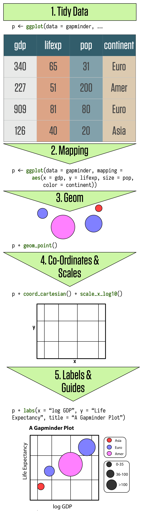
</center>

## The `ggplot` way [@healy2017]

<center>

</center>

## Start by defining the `data`

This line tells `ggplot()` which dataset to use and produces a blank plot.

```{r, fig.height=4}
  library(gapminder)
  ggplot(data = gapminder)
```

## Layering

For convenience, we're going to assign each step to an object called `p`. You can call it whatever you want. The key idea is that we create a base plot `p` and add to it in each step. So here, `p` is just an empty plot. If you want to see the result, you have to print `p`.

```{r, fig.show='hide'}
  p <- ggplot(data = gapminder)
  p
```

## Inspect the data

```{r}
  glimpse(gapminder)
```

## Declare `data` and `mapping`

The first two `ggplot()` arguments are `data` and `mapping`. We'll drop the `data=` and `mapping=` labels from here out. 

```{r}
  p <- ggplot(data = gapminder,
            mapping = aes(x = gdpPercap,
                          y = lifeExp))
  p <- ggplot(gapminder, 
              aes(x = gdpPercap, 
                  y = lifeExp)) # same thing
```

## The `aes()` function

* The `mapping` argument calls for aesthetic mappings of variables to plot elements. 
* Essentially, with `aes()` you tell `ggplot()` which variable from the dataset should map to the x-axis, and which should map to the y-axis.
* Here, we are mapping two variables from the dataset `gapminder`: `gdpPercap` goes to the x-axis, while `lifeExp` goes to the y-axis.

```{r}
  p <- ggplot(gapminder, aes(x = gdpPercap, y = lifeExp))
```

## What do we have so far?

Not much. We've just told `ggplot` to use the `gapminder` dataset and to map two variables, but we have not specified the type of plot we want. 

```{r, fig.height=3.75}
  p
```

## Specify a `geom()`

Use the `+` sign to add the next layer to this plot—a `geom()`! In this example, we add `geom_point()`, the points geom.

```{r, fig.height=3, message=FALSE}
  p + geom_point()  # not assigning to p on purpose
```

## {data-background-iframe="http://ggplot2.tidyverse.org/reference/index.html#section-layer-geoms"}

## Fine tune `geom_point()`

Check out the help file for your `geom` to learn more about use or review the great reference material on tidyverse.org: http://ggplot2.tidyverse.org/reference/geom_point.html

```{r}
  ?geom_point # learn about arguments
```

## Pick a different geom

This geom calculates a smoothed line and shades the standard error. Check out the arguments to `geom_smooth()` to tinker with the smoothing function used.

```{r, message=FALSE, fig.height=3}
  p + geom_smooth()
```

## Add both geoms

```{r, message=FALSE, fig.height=4}
  p + geom_point() + geom_smooth(method="lm") # change method
```

## Rescale the x-axis

```{r message=FALSE, fig.height=4}
  p + geom_point() + geom_smooth() + scale_x_log10()
```

## {data-background-iframe="http://ggplot2.tidyverse.org/reference/index.html#section-scales"}

## Add some scale labels

```{r message=FALSE, fig.height=4}
  p + geom_point() + geom_smooth() + 
      scale_x_log10(labels = scales::dollar)
```

## Change the look

```{r message=FALSE, fig.height=3}
  p <- p + geom_point(color="purple",
                      alpha = 0.3, # color transparency
                      size=2) +
           geom_smooth(method="loess", 
                       color="#FCF221") + # htmlcolorcodes.com
           scale_x_log10(labels = scales::dollar)
  p
```

## Add some labels

```{r, message=FALSE, fig.height=3}
  p <- p + labs(x = "GDP Per Capita", 
                y = "Life Expectancy in Years",
                title = "Economic Growth and Life Expectancy",
                subtitle = "Data points are country-years",
                caption = "Source: Gapminder.")
  p
```

## Change the theme

```{r, message=FALSE, fig.height=4}
  p + theme_minimal()
```

## {data-background-iframe="http://ggplot2.tidyverse.org/reference/index.html#section-themes"}

## Map aesthetics to variables

For instance, maybe instead of making all the points "purple", we want to color the points by values in the variable `continent`.

```{r}
  p <- ggplot(gapminder,
              aes(x = gdpPercap,
                  y = lifeExp,
                  color = continent))
```

## Adding the geoms

```{r, fig.height=4}
  p + geom_point() +
      geom_smooth(method='loess') +
      scale_x_log10()
```

## Can also map `shape` to point values

```{r, fig.height=3}
  ggplot(gapminder,
         aes(x = gdpPercap,
             y = lifeExp,
             shape = continent)) + # changed from color
         geom_point() +
         geom_smooth(method='loess') +
         scale_x_log10()
```

## Map `fill` to se

```{r}
  p <- ggplot(gapminder,
                aes(x = gdpPercap,
                    y = lifeExp,
                    color = continent,
                    fill = continent))
```

## Adding the geoms

```{r, fig.height=4}
  p + geom_point() +
      geom_smooth(method='loess') +
      scale_x_log10()
```

## Map aesthetics per geom

```{r, fig.height=3}
  p <- ggplot(gapminder,
              aes(x = gdpPercap,
                  y = lifeExp))
  p + geom_point(aes(color = continent),
                 alpha=0.6,
                 size=1) +
      geom_smooth(method='loess') + # just 1 line
      scale_x_log10()
```

## Small multiples

The group trends are hard to see. Let's try faceting by `continent` to make a series of "small multiples". First we need to get back to our basic plot defining point and line color:

```{r}
  p <- p + geom_point(color="purple",
                      alpha = 0.3, 
                      size=2) +
           geom_smooth(method="loess", 
                       color="#FCF221") +
           scale_x_log10(labels = scales::dollar)
```

## `facet_wrap()`

```{r, fig.height=4}
  p + facet_wrap(~ continent)
```

## Make it nice

```{r, fig.height=4}
  p + facet_wrap(~ continent, ncol = 5) +
      labs(x = "GDP Per Capita", 
           y = "Life Expectancy in Years",
           title = "Economic Growth and Life Expectancy on Five Continents",
           subtitle = "Data points are country-years",
           caption = "Source: Gapminder.") +
      theme_minimal() +
      theme(axis.text.x=element_text(size=6))
```

## Plotting Attendance
```{r plot, echo=FALSE}
  ggplot(attend_byCommunity, 
         aes(x=session, y=attended, group=factor(community))) +
  geom_line(color="grey") +
  geom_line(data=attend_All, size=2) +
  ylim(0, 100) +
  theme_bw() +
  theme(panel.grid.major = element_blank(), 
        panel.grid.minor = element_blank()) +
  ggtitle("Mean session attendance", 
          subtitle = "By community and overall") +
  ylab("Percent (%)") +
  xlab("Session")
```

## Plotting Attendance
```{r plot2, eval=FALSE}
  ggplot(attend_byCommunity, 
         aes(x=session, y=attended, group=factor(community))) +
  geom_line(color="grey") +
  geom_line(data=attend_All, size=2) +
  ylim(0, 100) +
  theme_bw() +
  theme(panel.grid.major = element_blank(), 
        panel.grid.minor = element_blank()) +
  ggtitle("Mean session attendance", 
          subtitle = "By community and overall") +
  ylab("Percent (%)") +
  xlab("Session")
```

## References

