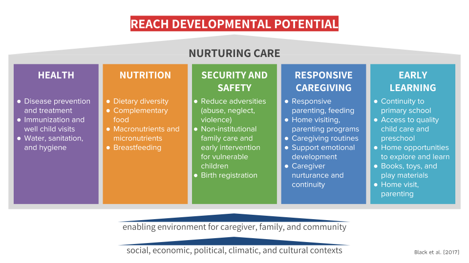

*The International Rescue Committee and researchers from Duke University have collaborated on two randomized evaluations of Parents Make the Difference, a group-based parenting skills intervention to decrease child maltreatment and improve parent-child interactions-thereby helping children to reach their developmental potential. We evaluated the intervention in Liberia, a conflict-affected and low-resource setting. The purpose of this study website is to store all study-related products and data (licensed under the [CC-BY license](https://creativecommons.org/licenses/by/4.0/)). New material will be released as academic manuscripts enter production.*

* * * 

In low- and middle-income countries, 250 million children under 5 years old are at risk for not reaching their developmental potential [@black:2017]. For most of these children, this is not due to one isolated risk factor but rather to risk factors that accumulate, or pile up, over these first important years of life. These include physical health problems, lack of basic needs due to extreme poverty, and violence at community and family levels, among others.

In the lifecourse conceptual framework outlined by Black et al. (2017), the pathway to developmental potential begins with an enabling environment for the caregiver, family, and community, which creates the conditions for nurturing care. A household that provides nurturing care is one that meets a child's health and nutritional needs, provides safety and security, has responsive caregivers, and stimulates the child's early learning.

Therefore, a major threat to a child reaching his or her developmental potential is the excessive use of harsh discipline—both physical and verbal—that can have lasting negative impacts [@cowell:2015;@walker:2011;@repetti:2002]. Risk for maltreatment seems to be higher for children in low-resource and conflict-affected settings, in which families face a wide range of stressors including displacement, separation, grief, poverty, and limited educational and employment opportunities [@borba:2016; @Mels:2010; @Reed:2012]. Given this, decreasing harsh discipline—and replacing it with positive behavior management strategies—is a primary, specific target of Parents Make the Difference program, or PMD.

In collaboration with the International Rescue Committee, and with funding from the UBS Optimus Foundation, we have conducted two randomized trials to evaluate the impact of PMD. In Study 1, we evaluated PMD with 270 caregivers in a rural area of Liberia, finding that the program decreased caregivers’ use of harsh discipline and increased positive interactions with their children. However, we did not see direct impacts on the children’s wellbeing. 

Based on these results, we revised the intervention to increase use of evidence-based strategies, including active practice and learning in sessions. We also developed a home visiting protocol to provide individualized skills coaching to caregivers. To test the revised intervention, we conducted a second study in Monrovia—an urban setting—that was larger and allowed for longer follow-up. This trial includes more than 800 caregivers randomly divided into three groups. Some caregivers received the group PMD sessions only, some received the PMD sessions plus home visits, and others were assigned to a waitlist control group. The trial is ongoing with results from the 12-month post-intervention follow-up expected in late 2018. Preliminary data from the 3-month post-intervention follow-up show a similar decrease in harsh discipline and increase in positive parent-child interactions.

# References